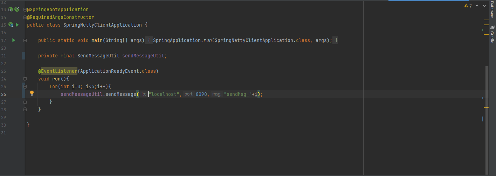
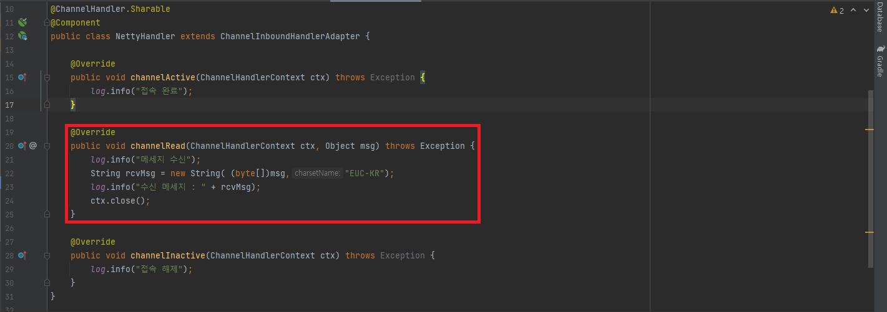
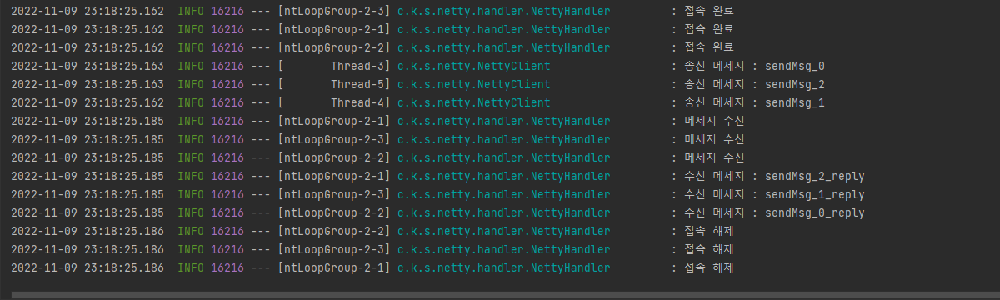

# spring_netty_client

Spring/Netty 기반 TCP 통신 클라이언트

async annotation을 사용하여 TCP 통신시에 비동기적으로 처리 가능

# 사용법

위처럼 SendMessageUtil을 이용하여 수신받는 ip와 port를 입력하고 원하는 송신 메시지를 세팅하면 된다.

데이터 전송 후, 수신 받은 데이터를 사용해야하는 경우,  NettyHandler의 해당 부분을 수정하여 사용하면 된다.

# 결과

연속으로 3개의 메시지를 비동기적으로 잘 처리하는 모습을 확인할 수 있다.

# 보완점

서버와 통신시, 비동기 처리를 위하여 매번 클라이언트 thread를 생성하는 구조이기 때문에 효율적인 메모리 사용을 필요로 한다면 threadpool을 이용하여 해당 thread를 관리하는 것이 좋아보인다.